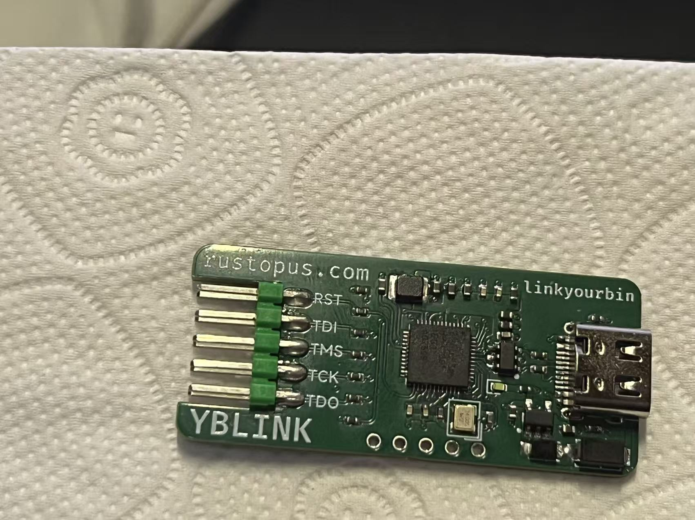
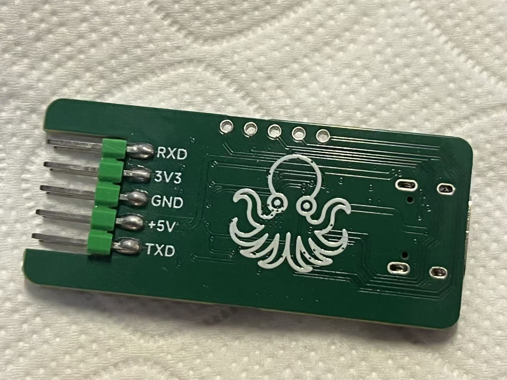
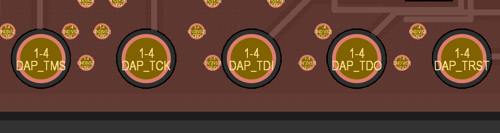

# YBLINK HPM5301 Firmware

Yet Better Link(YBLINK) is a pure-Rust CMSIS-DAP v2 probe firmware for HPM5301. The stable build
uses USB high speed, FGPIO bit-banged SWD/JTAG, and a CDC ACM USB-to-UART bridge.

Current stable USB identity:

| Field | Value |
| --- | --- |
| VID:PID | `1209:5301` |
| Product | `YBLINK CMSIS-DAP` |
| Serial | `YBLINK` |
| Firmware version | `0.1.0` |

## Features

- CMSIS-DAP v2 bulk endpoint, 512-byte USB-HS packets.
- SWD target access on PA27/PA28.
- JTAG target access on PA27/PA28/PA29/PA26.
- Hardware nRESET control on PB10.
- CDC ACM serial bridge on UART0, PA00/PA01.
- UART0 RX uses HDMA with a 96 KiB circular buffer.

## Pin Map

The firmware drives the HPM5301EVKLite J3 GPIO header. The target board must be
powered normally and must share ground with YBLINK.

### SWD

| YBLINK signal | HPM5301 pin | J3 pin | Target signal |
| --- | --- | ---: | --- |
| SWCLK | PA27 | 23 | SWCLK |
| SWDIO | PA28 | 21 | SWDIO |
| nRESET | PB10 | 26 | NRST |
| GND | GND | 25/30/34/39 | GND |

Leave PA26 and PA29 disconnected for normal SWD.

### JTAG

| YBLINK signal | HPM5301 pin | J3 pin | Target signal |
| --- | --- | ---: | --- |
| TCK | PA27 | 23 | TCK |
| TMS | PA28 | 21 | TMS |
| TDI | PA29 | 19 | TDI |
| TDO | PA26 | 24 | TDO |
| nRESET | PB10 | 26 | NRST |
| GND | GND | 25/30/34/39 | GND |

### Serial Bridge

| YBLINK signal | HPM5301 pin | J3 pin | External signal |
| --- | --- | ---: | --- |
| UART0 TXD | PA00 | 36 | Target RXD |
| UART0 RXD | PA01 | 38 | Target TXD |
| GND | GND | 25/30/34/39 | GND |

For a loopback smoke test, connect PA00/J3-36 directly to PA01/J3-38.

## Build

```bash
cargo build -p yblink --release
```

## Customized Board

|  |  |
| :-----------------------------------------------------: | :-----------------------------------------------------: |

A customized board is also hand-soldered and tested ok, and you can find the `sch`, `pcb` and gerber file in [hardware_altium_project](hardware_altium_project) directory. The five vias are for flashing the firmware(left to the right order). 



## Fresh Clone Build Steps

Install the Rust RISC-V target once:

```bash
rustup target add riscv32imafc-unknown-none-elf
```

Check the firmware:

```bash
cargo check -p yblink
```

Build the release firmware:

```bash
cargo build -p yblink --release
```

The output ELF is:

```text
target/riscv32imafc-unknown-none-elf/release/yblink
```

Flash it with an external probe:

```bash
probe-rs download --chip HPM5301 --protocol jtag target/riscv32imafc-unknown-none-elf/release/yblink
```

## Note

The hardware version is not stable right now. Make sure that you connect `PA10` to a LED if you want to make your own `YBLINK`.

`3V3 -> RES(1K~10K) -> LED -> PA10`